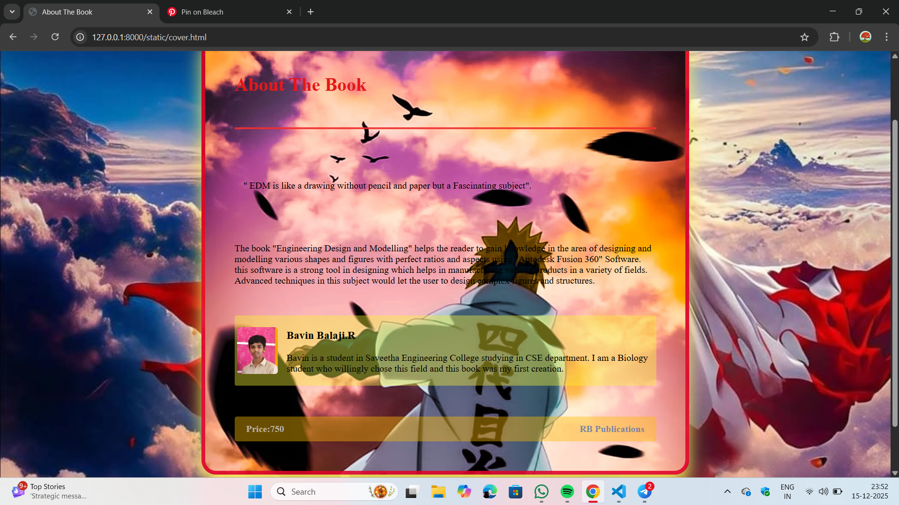

# Ex.05 Book Cover Page Design
## Date:15/12/2025

## AIM:
To design a book back cover page using HTML and CSS.

## DESIGN STEPS:

### Step 1:
Create a Django Admin project.

### Step 2:
Create an app in the Django interface.

### Step 3:
Create a folder named 'static' in the app folder.

### Step 4:
Create a new HTML file in the static folder.

### Step 5:
Write the HTML code with relevant CSS properties.

### Step 6:
Choose the appropriate style and color scheme.

### Step 7:
Insert the images in their appropriate places.

### Step 8:
Publish the website in the LocalHost.

## PROGRAM:
~~~
cover.html

<html>
 <head>
        <title>About The Book</title>
        <link rel="stylesheet" href="styles.css">
    </head>

<body>
    

        <h1>About The Book</h1>
        

        
            

            " EDM is like a drawing without pencil and paper but a Fascinating subject".
            

            The book "Engineering Design and Modelling" helps the reader to gain knowledge in the area of
designing and modelling various shapes and figures with perfect ratios and aspects using "Autodesk Fusion 360" Software. this software is a
strong tool in designing which helps in manufacturing various products in a variety of fields.
             Advanced techniques in this subject would let the user to design complex figures and structures.
             

       
        
        

            
            

                <h3>Bavin Balaji.R</h3>
                

                    Bavin is a student in Saveetha Engineering College studying in  CSE department. I 
am a Biology student who willingly chose this field and this book was my first creation.  
                                    

            

        

        

            Price:750
            RB Publications
        

    

</body>
</html>

styles.css

 body {
    margin: 0;
    padding: 0;
    background: rgb(180, 29, 29);
    background-image:url('minato.jpg');
}

.container {
    width: 620px;
    height: 650px;
    background-image:url('minato2.jpg');
    background-size: cover;
    background-position: center;
    border: 7px solid rgba(223, 3, 43, 0.888);
    border-radius: 25px;
    box-shadow: 0 20px 30PX rgb(245, 234, 92);
    display: flex;
    flex-direction: column;
    justify-content: space-between;
    padding: 50px;
    margin: 100px auto;
    
}

h1 {
    color: rgb(230, 23, 23);
    
}

.title-line {
    border: none;
    height: 2px;
    background-color: black;  
    width: 2xpx;
    margin: 0 0 15px 0;
}

.quote {
    
     
    padding: 15px;
    margin: 25px 0;
    font-style: roman;
}

.author {
    display: flex;
    align-items: center;
    background: rgba(173, 172, 103, 0);
    padding: 4px;
    border-radius: 3px;
    margin-top: 2px;

}

.aut-img {
    width: 70px;
    height: 80px;
    border-radius: 5px;
    margin-right: 15px;
    object-fit: cover;
}

.footer {
    margin-top: 20px;
    display: flex;
    justify-content: space-between;
    background: rgba(255, 187, 0, 0);
    color: rgba(201, 195, 195, 0.847);
    padding: 12px 20px;
    border-radius: 4px;
    font-weight: bold;
}

.publisher {
    color: rgba(16, 78, 195, 0.56);
}
 

 
 

~~~

## OUTPUT:

## RESULT:
The program for designing book back cover page using HTML and CSS is completed successfully.
